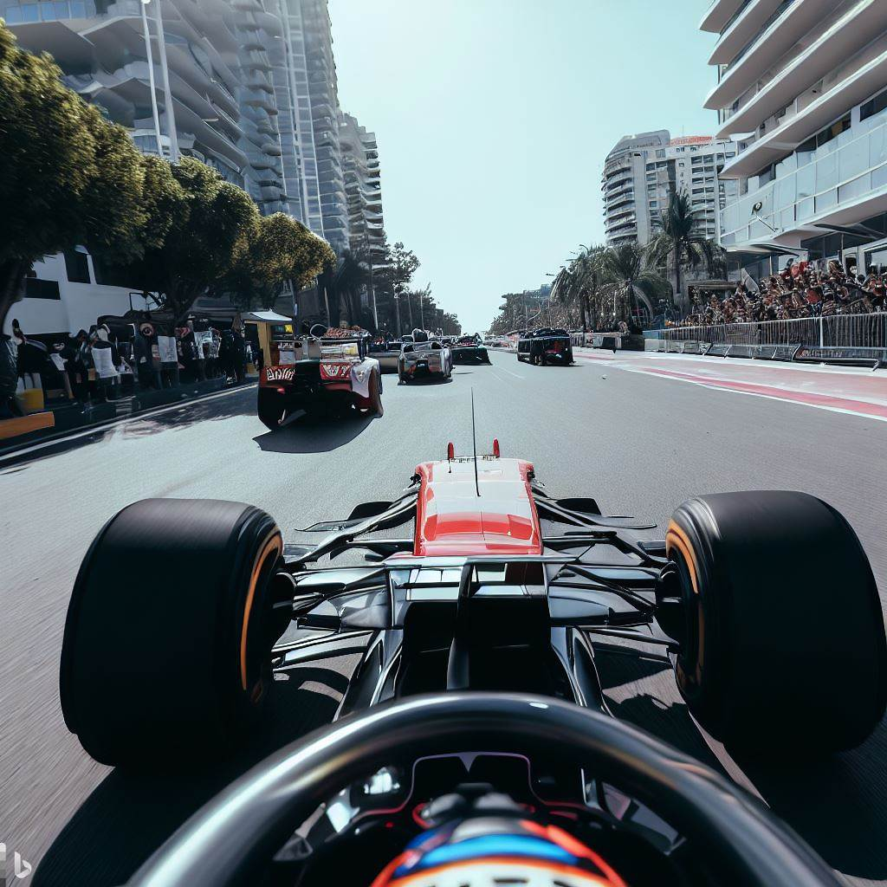
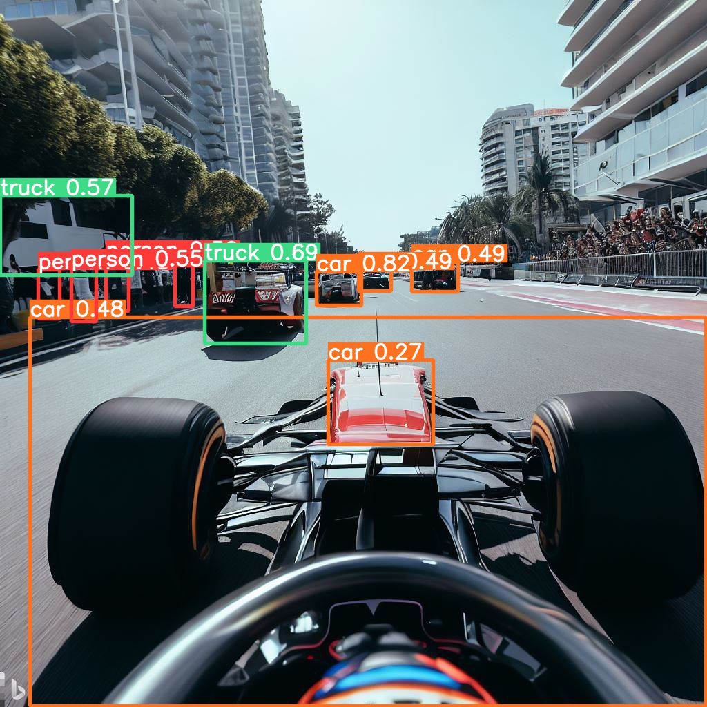
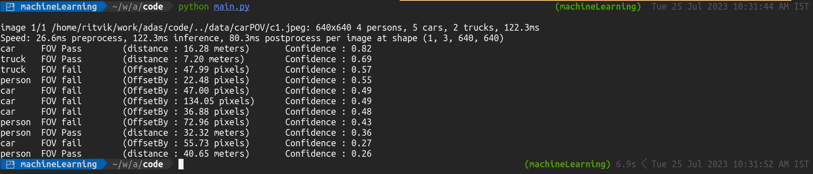

# ADAS - Monocular System based Distance Calculation

This system uses a single camera (monocular system) as its input. The deep learning model employed for object detection is the **YOLOv8 Large** `(yolov8l.pt)` model. After detecting [objects of interest](#objects-of-interest) in each frame of the video input, the system then estimates the distance to each object.

The distance estimation method is based on the known actual width of the object, the known focal length of the camera, and the size of the object in pixels in the image.

The input image width is fixed at `640` pixels. The height may be varied, either `640 or 480` pixels.

## Distance Estimation

The system calculates the distance of objects from the camera using a monocular vision-based approach. The distance is estimated using the known width of the object and the focal length of the camera. 

We apply the following formula for distance calculation:

`distance = (real_width * focal_length_pixels) / observed_width_pixels`

Where,

- `real_width` is the actual width of the object in the real world (in meters).
- `focal_length_pixels` is the focal length of the camera (in pixels).
- `observed_width_pixels` is the width of the object in the image (in pixels).

The focal Length can be obtained from the following documentations:  
Camera Used - [Pi Camera Module 2]()  
[Hardware Specifications of Camera](https://www.raspberrypi.com/documentation/accessories/camera.html#hardware-specification)


## Field of View Estimation

Our aim is to detect and focus on objects that are within a certain percentage of the center of our image, which is specified in [constraints.json](./code/constraints.json). Here's how we computed the start and end points to represent this Field of View (FOV):

1. **Percentage to Decimal:** First, we converted the given percentage into a decimal. For instance, if the percentage is 75, the decimal equivalent would be 0.75.

    ```md
    PERCENTAGE_DECIMAL = PERCENTAGE_FOV / 100
    ```

2. **Calculating the Remaining Area:** We then calculated the remaining area on the image that's not included in our FOV. This area is split equally on both ends of the image. 

    ```md
    REMAINING_DECIMAL = (1 - PERCENTAGE_DECIMAL) / 2
    ```

3. **Calculating Start and End Width:** Finally, we computed the start and end points (in pixels) of the FOV. The start width starts from the left end of the image and the end width from the right end.

    ```md
    START_WIDTH = IMAGE_WIDTH * REMAINING_DECIMAL
    END_WIDTH = IMAGE_WIDTH * (1 - REMAINING_DECIMAL)
    ```

So, if we take an IMAGE_WIDTH of 640 pixels, the calculated START_WIDTH and END_WIDTH for a 75% FOV would be 80 and 560 respectively. This means that our region of interest lies between the 80th pixel and the 560th pixel of the image width.

### Determining the Center of the object:
From the tensor returned from the yolov8 model, we have xmin, ymin, xmax, ymax, conf and class values. We consider the midpoint of xmin and xmax.

```md
center_x = (box[2] + box[0]) / 2
```

where `box[2]` and `box[0]` correspond to xmax and xmin of the bounding box in the tensor.

Objects detected outside of this region (whose center_x does not lie in out FOV )are not within our specified FOV and can be ignored.


## Test Run

The data (images) required for running tests has been generated from a stable diffusion model (Bing AI).  
For real world uses, the values in [constraints.json](./code/constraints.json) needs to be calibrated with the camera position on the motor drive.  

##### Objects of Interest:
`["car", "person", "truck", "traffic light", "traffic lights", "bicycle", "motorcycle", "bus", "train", "truck"]`

### Test Image


### Resultant Image


## Test Run Result



The low Confidence predictions would be eliminated in production.e